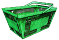
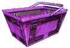
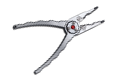

<!--Read this in github to have all the visuals and formatting: https://github.com/manux32/7dtdSdxMods/tree/master/Manux_BasicFishing-->
# Basic Fishing
A simple Fishing mod, inspired by [**Clockwork Orange**](https://7daystodie.com/forums/showthread.php?68123-ACP-Fishing) and [**Carzilla**](https://7daystodie.com/forums/showthread.php?37132-Carlzilla-s-Fishing-Mod&highlight=fish+recipes)'s Fishing mods.  
I'm also using many icons from their mods.  
The mods were adapted to what I wanted, especially making it easier to bait the Fishing Rod, without using a recipe each time.  
I did not yet add any progression gates for being able to craft these items.

## Items
|  |  |  |  |  |  |  |
|:---:|:---:|:---:|:---:|:---:|:---:|:---:| 
| Fishing Rod | Fishing Trap | Fish Bait | Fish Bait Basket | Fishing Trap   Bait Basket | Fishing Pliers | Raw Fish |

## Fish recipes
|  |  |  |  |  |
|:---:|:---:|:---:|:---:|:---:| 
| Grilled Fish | Boiled Fish | Charred Fish | Fish Stew | Fish And Chips |

## How to fish
### Fishing Rod
#### Required items
- Fishing Rod
- Fish Bait
- Fish Bait Basket
- Fishing Pliers
#### Steps
- Put the Fish Bait Basket on the ground close to where you want to fish.
- Using the Fishing Pliers, upgrade(right-click) the Fish Bait Basket to add Fish Bait in it. Fish Bait(gore block) will spawn on top of the basket.
- Using the Fishing Rod, aim at the Fish Bait that's on top of the basket, and right-click to put Fish Bait on the Fishing Rod. You will see the Fishing Rod icon change to indicate it is baited. Be fast, otherwise the bait will escape.
- Using the Fishing Rod, right-click a body of water to start fishing.
- When you have caught something, the fishing Rod icon will change to indicate it, and its mesh will become a bag.
- Right-click on the ground with your Fishing Rod to put a Livewell there. Than loot it!

### Fishing Trap
#### Required items
- Fishing Trap
- Fish Bait
- Fishing Trap Bait Basket
- Fishing Pliers
#### Steps
- Put the Fishing Trap Bait Basket on the ground close to where you want to fish.
- Using the Fishing Pliers, upgrade(right-click) the Basket to add Fish Bait in it. Fish Bait(gore block) will spawn on top of the basket.
- Using the Fishing Trap, aim at the Fish Bait that's on top of the basket, and right-click to put Fish Bait in the Trap. You will see the Fishing Trap icon change to indicate it is baited. Be fast, otherwise the bait will escape.
- Using the Fishing Trap, right-click a body of water to start fishing.
- When you have caught something, the fishing Trap icon will change to indicate it, and its mesh will become a bag.
- Right-click on the ground with your Fishing Trap to put a Livewell there. Than loot it!

## Potential conflicts:
This mod adds 2 new lootcontainers in **loot.xml**, IDs **145-146**.  
If you are using mods that already use those lootcontainers IDs, you will need to change them either in this mod or in the other mods. You need to change both the ID of the lootcontainer in **loot.xml**, but also the ID on the block that points to it in **blocks.xml** (the value of the property **LootList** of the block).
