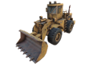
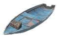
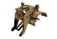
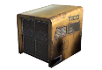
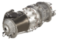
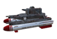
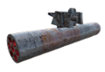
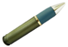
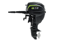
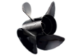

<!--Read this in github to have all the visuals and formatting: https://github.com/manux32/7dtdSdxMods/tree/master/Manux_HPMiniBike-->

# Custom Vehicles 
|  |  |  |  |  |  |  |  
|:---:|:---:|:---:|:---:|:---:|:---:|:---:|  
| Dust2Death's Road Hog | Hell Goat Bike | Quad | Cicada Car | The Beast (Loader) | Helicopter | Small Boat |  

### Game Version: 
#### A16
- This is the full mod version and it's currently only availlable for A16.
#### A17
I made an XML-only modlet for A17 which includes some of my vehicles. I will not port the full mod to A17 until after A17 stable ships.
- [**A17 modlet**](https://github.com/manux32/7d2d_A17_modlets/tree/master/manux_CustomVehicles_A17_modlet)
- [**A17 modlet - SDX version**](https://github.com/manux32/7d2d_A17_sdx_mods/tree/master/manux_CustomVehicles_A17_modlet)

### Intro
The Custom Vehicles mod is there to help you build your own custom vehicles, from custom Bikes to custom Cars, Quads, Trucks, and even Boats!  
You can make all-terrain vehicles that can climb small and medium objects, and control the camera distance, and player position/orientation on the vehicle.  

The mod already includes a bunch of functionnal vehicles. It can be compiled on top of vanilla, or mixed with other SDX mods, to get whatever type of experience you are looking for.  

Sadly, it cannot be deployed on top of big mods that already modify the game's Assembly, because we don't have the source code for those mods, and SDX cannot compile on top of an already modified Assembly.

### Recently added features
- The mod is now **MP compatible**. It's not perfect in MP because of some of the game's limitations with Vehicles, but the mod seems to work without issues.
- New **Boat** Vehicle! This is now my favorite vehicle! You can even fish from it if you use my Fishing mod or any other Fishing mod. You can also spawn the chassis directly on water.  
- Any vehicle can be set to float on water. But only the Boat creates a Floating Block platform when you stop driving it on water. Use the new vehicle entity_class _<property name="FloatsOnWater" value="true" />_ node to enable floating on water.
- New **Feet IK** and **Head LookAt** features when driving the vehicle. The Small Boat is the only one using those new features for now.   
- The **Airtight** feature has been improved. Vehicles that have it enabled now keep you at ideal temperature, and you slowly dry off if you were wet when entering it.  
- Show remaining Vehicle Weapons Ammo on HUD  
- Individual Vehicle icons now show up in all UIs  
- Thanks to **Three8**, all vehicles now have the abillity to go underwater (controlled via XML properties).  
- All Vehicles can also destroy and harvest the environment and buildings. You can control what gets destroyed and harvested  through XML properties on the vehicle's entityclass. You can also set it to harvest directly to the vehicle storage.  
- And we now have our first flying vehicle, the Helicopter. This is still a bit experimental, but it works, and it's so much fun! And it also now shoots bullets and missiles!  
- Actually all vehicles can now shoot bullets and explosives of all sorts. :stuck_out_tongue_winking_eye: 2 new weapon parts slots have been added to all vehicles.
- You can now make custom exclusive vehicle parts
- Custom storage size
- built-in storage
- New UI buttons for Vehicle Storage: Take All, Drop All
- New UI buttons for Player Backpack: Stash All, Stash all but first row

### Building your own vehicles
The mod contains multiple different examples of already functionnal bikes and cars/trucks.  
It also contains examples of custom vehicle parts. Check-out the [**Custom Vehicle Parts section**](#custom-vehicle-parts).  
I will eventually try to make tutorials or youtube vids to help you build your own, if there is enough demand for it.  

If you want to build your own, I recommend starting with something simple like a custom bike. The Car, Quad, Loader and Helicopter are more complex on the rigging side.  
You can grab Unity template scenes for a Custom Bike and a Custom Car [**here**](https://drive.google.com/drive/folders/1Ke6T4T10FMly86gZedYfcR0-j0TuCkG7?usp=sharing).  
I can provide templates for other vehicles if needed, just ask me on the [**forum thread**](https://7daystodie.com/forums/showthread.php?87828-Custom-Vehicles-by-Manux-SDX).  

### Mod Terms of Use and License
Please check the [**Terms of Use**](#terms-of-use) section, especially if you want to include this mod and it's 3D assets in another mod that you will distribute. Some of the vehicles were built from purchased 3D assets, and are under licensing terms that add additionnal restrictions to what you can do with them.

### Special Thanks
Special Thanks to **DUST2DEATH** for making the ball roll on this one.  
See the complete ***Special Thanks*** section [**here**](#special-thanks).  

## Vids
### Bike, Quad, and Car
| [](https://www.youtube.com/watch?v=jd1xWsgqwCg "Custom Driveable Cars") | [](https://www.youtube.com/watch?v=au5lZz8cKmQ "All-Terrain Vehicles") | [](https://youtu.be/2hulHrWwcE8 "Weapons now on all Vehicles") |  
|:---:|:---:|:---:|  
|Custom Driveable Cars|All-Terrain Vehicles|Weapons now on all Vehicles|  

### The Beast
[](https://youtu.be/MXkOzT_1-nM "Custom Loader that destroys everything on its path") | [](https://youtu.be/OehnLqXRZIU "Custom Loader vehicle: a horde killer") | [](https://youtu.be/05JCymS6XHI "The Beast now harvests what it destroys") | [](https://youtu.be/tAwpDKaP1w0 "Sneak peek of new destruction and underwater features") |  
|:---:|:---:|:---:|:---:|  
|Custom Loader that destroys everything on its path|Custom Loader vehicle: a horde killer|The Beast now harvests what it destroys| Sneak peek of new destruction and underwater features |  

### Flying
[](https://youtu.be/25foBmCLDSE "A little surprise to cheer your Monday up!") | [](https://youtu.be/JhAJ4osfxDE "Monday's surprise part 2") |
|:---:|:---:|  
|A little surprise to cheer your Monday up!|Monday's surprise part 2|  

### Water
[](https://youtu.be/DYWiii4KhVA "First Boat Vehicle") |  
|:---:|  
|First Boat Vehicle|  

## Installation  
**Availlable for A16 only** (for now...)  
All my mods are built for being compiled and deployed with [**SDX Launcher version 0.72c**](https://github.com/SphereII/SDXWorkshop/blob/master/SDX0.7.2c.zip).  
If you don't know what SDX is, go [**here**](https://7daystodie.com/forums/showthread.php?72888-7D2D-SDX-Tutorials-and-Modding-Kit), and make sure you do the tutorials to know how to create an SDX mods build environment.  

### Updating the mod
Because this mod is currently under construction, you should always delete the old version of the mod before copying the new one. Some files are sometimes deleted or renamed in a new update, and it would create errors or issues if you don't do that.

## Dependencies
This mod has dependencies on [**Hal's DLL Fixes**](https://github.com/7D2DSDX/Mods/tree/master/HalDllUpdates) mod.  
Make sure you also deploy that mod for this one to work.  
The SDX Launcher shouldn't let you build if you don't have it or don't have it enabled.   

## Multiplayer
The mod is currently fully functional for Single Player games.  
The latest version seems to also be fully functional for Multi Player games.  
If you try it in multiplayer and find problems, please report them on the mod's [**forum thread**](https://7daystodie.com/forums/showthread.php?87828-Custom-Vehicles-by-Manux-SDX).

## Potential conflicts:
This mod adds new lootcontainers in **loot.xml**, for the custom vehicle storages:  
- IDs **189-191** for the regular mod.
- IDs **192-194** when you also use my [**Bigger Backpack mod**](https://github.com/manux32/7dtdSdxMods/tree/master/Manux_BiggerBackPackMiniBikeContainersCraftingSlots).  
If you are using mods that already use those lootcontainers IDs, you will need to change them either in this mod or in the other mods. You need to change both the ID of the lootcontainer in **loot.xml**, but also the ID on the block that points to it in **blocks.xml** (the value of the property **LootList** of the block), or if it's entities that point to them, you need to change their **LootListAlive** value in **entityclasses.xml**.

## Vehicle Controls
Most Vehicles use the regular Keyboard Controls of the MiniBike. Some of them have additional or replacement Controls, see lists below.
### All Vehicles
All vehicles now have additionnal controls for the camera and weapons. Vehicle Weapons and Ammo can be different per vehicle, all definable in xml. Custom parts can be defined for the weapons.
- **Mouse Scroll-Wheel**: Zoom in-out in 3rd person view
- **Home**: Toggle between 3rd person and 1st person view
- **Left Mouse Button**: Shoot bullets from machine gun
- **Right Mouse Button**: Shoot Explosives (Grenades, Missiles, Tank Shells)

### The Beast
The Beast's bucket's height determines how high/low objects can be destroyed and harvested. The bucket can be moved up/down, and rotated up/down, but the rotation is mainly for aesthetics, only the height really determines what you destroy.
- **UpArrow**: Move the Bucket Up
- **DownArrow**: Move the Bucket Down
- **LeftArrow**: Rotate the Bucket Down (Outward)
- **RightArrow**: Rotate the Bucket Up (Inward)  

### Helicopter
The Helicopter does not use the Minibike base control scheme, it has it's own. But some of them are very similar to the MiniBike.
- **LeftShift**: Lift/Increase main rotor speed
- **Space**: Down/Decrease main rotor speed
- **W**: Move/Tilt Forward
- **S**: Move/Tilt Back
- **A**: Turn/Tilt Left
- **D**: Turn/Tilt Right
- **LeftArrow**: Rotate Left
- **LeftArrow**: Rotate Right
- **Backspace**: Start/Stop Music  (same music as in the Helicopter Vid above)

## Custom Vehicle C# classes  
### EntityCustomBike
To make Custom Bikes (2 Wheels).  
XML Example:
```XML
<entity_class name="hellGoatBike">
        <property name="Class" value="EntityCustomBike, Mods" />
        ...
</entity_class>
```
### EntityCustomCar
To make Custom Cars/Trucks/Quads (4 wheels).  
Making Custom Cars is more complex than making Custom Bikes, it requires more rigging know-how. To function, it requires additionnal bones and a different hierarchy than the Bikes, in order to have the 2 front wheels behave like a car.
XML Example:
```XML
<entity_class name="cicadaCar">
        <property name="Class" value="EntityCustomCar, Mods" />
        ...
</entity_class>
```
### EntityCustomLoader
This one is even more complex than the Custom Cars. It requires more advanced rigging know-how. The current code is partially hardcoded for The Beast. I might make it more flexible in the future, to be able to make other types of construction vehicles with it.
XML Example:
```XML
<entity_class name="loader">
        <property name="Class" value="EntityCustomLoader, Mods" />
        ...
</entity_class>
```
### EntityCustomHelicopter
Yes, we now have a class for Helicopters! Still a bit experimental and currently harcoded for this Helicopter's Rig. But I will try to make it more flexible for any types of helicopter in the future...  
XML Example:
```XML
<entity_class name="helicopter">
        <property name="Class" value="EntityCustomHelicopter, Mods" />
        ...
</entity_class>
```  
### EntityCustomBoat
And we now have a class for Boats too! Still a bit experimental and currently partially harcoded for the new Small Boat vehicle. But I will try to make it more flexible for any types of Boat in the future...  
XML Example:
```XML
<entity_class name="smallBoat">
        <property name="Class" value="EntityCustomBoat, Mods" />
        ...
</entity_class>
```

### ItemActionSpawnCustomVehicle
This class is there to be able to spawn a custom vehicle from the custom Chassis item of the vehicle.  
The class is common to all vehicles, the vehicle to spawn is defined through the ***VehicleToSpawn*** XML property.  
For example:  
```XML
<item id="" name="hellGoatBikeChassis">
    <property name="Extends" value="robustBikeChassis"/>
    <property name="Meshfile" value="#HellGoatBike?HellGoatBikeChassisPrefab" />
    <property class="Action1">
        <property name="Class" value="SpawnCustomVehicle, Mods" />
        <property name="VehicleToSpawn" value="hellGoatBike"/>
    </property>
</item>
```

## Vehicles entity_class XML properties
New XML properties are supported to control different apsects of your custom vehicles.  
You have to add these in your vehicle's entity_class.  
### Camera and Player controls

To control how far the camera is when driving the vehicle  
```XML
<property name="CameraOffset" value="0, 2, -8" />
```  

Is the 3rd person player visible on the vehicle.  
```XML
<property name="3rdPersonModelVisible" value="false" />
```  

3rd person player position and rotation offsets on the vehicle. Rotation also moves the player arround, so you need to play with values to achieve what you want.  
```XML
<property name="PlayerPositionOffset" value="0, 0, 0.15" />
<property name="PlayerRotationOffset" value="15, 0, 0" />
```  

Custom Vehicle Exit Position for the Player. Offset from the Vehicle position.
```XML
<property name="PlayerExitPosition" value="0, 2, 0" />
```

New IK Features for Feet and Head Lookat.  
```XML
<property name="PlayerLookForward" value="true" />
<property name="ParentLeftHandIKtoChassis" value="false" />
<property name="ParentRightHandIKtoChassis" value="true" />
<property name="left_foot_ik_position" value="0.08, 0.19, -2.289" />
<property name="right_foot_ik_position" value="0.08, 0.16, -1.829" />
<property name="left_foot_ik_rotation" value="-9.814, -90, 0" />
<property name="right_foot_ik_rotation" value="-9.814, -90, 0" />
```  

### CharacterController (vehicle movement and collider)
```XML
<property name="ColliderCenter" value="0, 2.07, -0.01" />
<property name="ColliderRadius" value="2" />
<property name="ColliderHeight" value="4.1" />
```  
A vehicle in 7d2d moves arround using a Unity [**CharacterController**](https://docs.unity3d.com/530/Documentation/ScriptReference/CharacterController.html) component. [Unity Scripting documentation](https://docs.unity3d.com/530/Documentation/Manual/class-CharacterController.html).  
(_The Helicopter is an exception, it has it's own custom controller to move arround._)

The above XML properties let you change the values of the public properties that exist on the CharacterController component of your custom vehicle.  
If you add a CharacterController component to an object in Unity, you will see properties with similar names in the Inspector.  
To know what values to set for the ***ColliderCenter, ColliderRadius, and ColliderHeight***, you can simply add a CharacterController component to your custom vehicle's prefab root in Unity, and modify those values until it best fits the volume of your vehicle.  
We are sadly stuck with the built-in capsule collider of the CharacterController component at this point, since this is what TFP uses for drivable vehicles. A Capsule collider is limited in how well you can adjust it to the extents of your vehicle, just fit it as best as you can.  
**Note:** Make sure to remove that CharacterController component from you prefab before exporting, to not cause undesired effects in the game.  
The best is to add it to another object if you want to keep it in your Unity scene. Just make sure that object is not in you prefab hierarchy and that it has the same transform position and rotation as your prefab root when you want to tweak it for changing the XML values.

### All-terrain vehicles settings
```XML
<property name="ColliderSkinWidth" value="0.0001" />
<property name="ControllerSlopeLimit" value="90" />
<property name="ControllerStepOffset" value="1" />
```  
The above are for making all-terrain vehicles that can climb objects.  

***ControllerSlopeLimit*** is by default at **45** in Unity. Set it to **90** to be able to climb steep terrain slopes. I tried smaller values, but only 90 or greater seemed to work.  

***ControllerStepOffset***: *from Unity docs: "The character will step up a stair only if it is closer to the ground than the indicated value. This should not be greater than the Character Controller’s height or it will generate an error.*"  
From what I understand, a step of **1.0** lets you climb over a single block. If you have a taller vehicle like the Loader, you can set it higher to be able to climb over 2-3-4 blocks. But never set it higher than the Character Controller’s height (***ColliderHeight*** XML property).  

***ColliderSkinWidth*** Can be left to the default value that shows in Unity: **0.08**.  
But putting a smaller value like **0.025** can help it climb better.  
Don't put too small of a value, otherwise, your vehicle might get stuck when it collides with other colliders. 

### Vehicles UI activation volume
```XML
<property name="VehicleActivationCenter" value="0, 2, -0.05" />
<property name="VehicleActivationSize" value="3, 4, 6" />
```  
There is another collider(Box collider) present on vehicles. It does not colide with the environment, it's only there to define the volume for the activation UI of the vechicles.  
Just like for the CharacterController above, you can make a dummy Box Collider in your Unity scene to know what values to put in there.  

### Water features  
```XML
<property name="WaterCraft" value="true" />
<property name="Airtight" value="true" />
<property name="FloatsOnWater" value="true" />
<property name="FloatHeight" value="0.05" />
```
**Watercraft:** Can the vehicle go on/in the water.  
**Airtight:** Is the vehicle "airtight" when under water.  If set to True, the player will still be able to breath when driving underwater. The feature now also keeps the player at ideal temperature when driving (heater and air conditionning), and you will slowly dry up if you were wet before entering the vehicle.  
**FloatsOnWater:** Can the vehicle float on water. Only currently used on the Small Boat, but any vehicle can now float. Only the Small Boat creates a vehicle platform when you stop driving it on water. You can Fish from that platform.   
**FloatHeight** The offset of the Vehicle from Water when it's floating.

### Detroy and Harvest
Additionnal XML properties to control destruction and harvesting of the environment with the vehicle. It can destroy and harvest pretty much anything, all controllable per vehicle via XML.  
Vehicles also kills zombies and other creatures when you drive over them.  
And Vehicles get damage from destroying blocks or killing zombies or creatures.   
```XML
<property name="EntityDamage" value="1000" />
<property name="EntityHitMinSpeed" value="1" />
<property name="EntityCriticalHitMinSpeed" value="1" />
<property name="BlockDamage" value="10000" />
<property name="VehicleDamageFactor_blocks" value="4" />
<property name="VehicleDamageFactor_entities" value="4" />
<property name="DestructionRadius" value="3" />
<property name="DestructionStartHeight" value="1" />
<property name="DestructionHeight" value="3" />
<property name="DestructionHarvestBonus" value="1.4" />
<property name="DestroyBlocks" value="grass,plant,cactus,shrubOrBush,tree,rock,bigBoulder,rareOres,tire,fenceOrDoor,buildings,softDebris,hardDebris,poleOrPillar,car,furniture,devices,curb,trap,terrain,lootCtn" />
<property name="HarvestBlocks" value="plant,cactus,shrubOrBush,tree,rock,bigBoulder,rareOres,tire,fenceOrDoor,buildings,softDebris,hardDebris,poleOrPillar,bench,car,furniture,devices,curb,trap,terrain,lootCtn" />
<property name="HarvestToVehicleInventory" value="true" />
<property name="DestroyXPFactor" value="0.5" />
<property name="HarvestXPFactor" value="0.5" />
```  

### Built-in Storage
A Vehicle can have "built-in" storage, which means that you don't need a shopping basket part in order to have storage in it.  
The Cicada Car and the Helicopter have built-in storage. Other vehicles require a storage part like the shopping basket.  
Add the new "_**is_built-in_storage**_" XML property to the storage part of a your vehicle xml definition in order to enable this feature. And also remove the existing "_**slot_type**_" property from it.  
For example:  
```XML
<property class="storage">
        <property name="class" value="Storage" />
        <property name="is_built-in_storage" value="true" />
        <property name="parent_part" value="chassis" />
</property>
```

When you do this, it means that you now have one less part slot on your vehicle. To avoid any bugs with this, you need to add an additionnal empty slot in your vehicle xml, like this:
```XML
<property class="empty1">
        <property name="class" value="Empty, Mods" />
        <property name="slot_type" value="empty" />
        <property name="parent_part" value="chassis" />
</property>
```

### Empty slots
On top of having built-in storage, the Helicopter also emliminates another vehicle part, the wheels.  
In this case, we need to add 2 empty slots in its vehicle xml. You should give different names to each empty slots, like this:  
```XML
<property class="empty1">
        <property name="class" value="Empty, Mods" />
        <property name="slot_type" value="empty" />
        <property name="parent_part" value="chassis" />
</property>
<property class="empty2">
        <property name="class" value="Empty, Mods" />
        <property name="slot_type" value="empty" />
        <property name="parent_part" value="chassis" />
</property>
```

### Custom Vehicles Storage Size
You can define different storages sizes for the different vehicles. The mod currently includes 3 storage sizes:  
- Small: 4x6
- Medium: 5x9
- Large: 8x10  

If you also use my [**Bigger Backpack mod**](https://github.com/manux32/7dtdSdxMods/tree/master/Manux_BiggerBackPackMiniBikeContainersCraftingSlots), it will detect it and deploy bigger storage sizes:
- Small: 6x9
- Medium: 10x10
- Large: 12x15  

To define new custom storages, you need to create a custom xui.xml vehicle window_group that includes a new windows.xml window for the storage.  
You also need a custom lootcontainer that is set to the same number of rows and columns as your new storage window.  
Check the ui_edits.xml file in this mod for examples on the ones that ship with the mod.   
You specify the custom storage per vehicle using a new "VehicleXuiName" XML property for the xui.xml window_group and use the existing "LootListAlive" property for the lootcontainer:  
```XML
<property name="VehicleXuiName" value="vehicleMediumStorage" />
<property name="LootListAlive" value="190" />
```

### Open UIs while driving
If you want to be able to open UIs like the Map, the backpack, or any other Character UIs, while driving, simply download [**Tormented Emu's MinibikeOpenUI mod**](https://github.com/TormentedEmu/7DTD-SDX-Mods/tree/master/MinibikeOpenUI), and add it to your SDX Mods directory.  


## Custom Vehicle Parts
You don't need this mod to make your own custom parts for vehicles, it can be done through xml.  
But if you do that and rename vehicle parts slots, you will end up with many different bugs. TFP has code that hardcodes the parts slots names, so if you change the name of the vehicle slots, it will create issues.  

In this mod, I patched TFP's code, and added a new way of defining custom vehicle parts that fully work. This means that you can now make exclusive custom parts for all your vehicles, while insurring that users can only use the parts meant for each vehicle. The custom parts can change things like how fast your vehicle goes (engine), how robust it is, etc...

All the vehicle's custom parts in this mod now use this new system. Check the xmls to see examples.  
Each vehicle always has a custom chassis item for items.xml, to be able to spawn that specific type of vehicle.  
I made the icons show the whole vehicle so you know what you are spawning:  

|  |  |  |  |  |  |  |  
|:---:|:---:|:---:|:---:|:---:|:---:|:---:|  

### 2 New weapon parts slots
In the last version I added 2 new parts slots to be able to have 2 weapons per vehicle: a machine gun and an explosive launcher.  
You can make your own custom vehicle parts to populate those new slots, or you can use the ones I already made. See those 2 new files: **vehicleWeapons.xml** and **vehicleAmmo.xml**.

#### Examples of vehicle UIs with those 2 new slots:
|  |  |  
|:---:|:---:|  
| Dust2Death's RoadHog | Helicopter |  

### How to define custom parts
- Always keep the regular vehicle slot names identical to the minibike (***slot_type*** on vehicle parts and ***VehicleSlotType*** on part items).
- Add a new xml property on a vehicle part to make it a custom part and set it's value to the name of the custom item.
_Example:_
```XML
<property name="custom_slot_type" value="helicopterMissileLauncher" />
```  
- Also add this new property to the part item. This will prevent using that part in regular vehicle slots.  
```XML
<property name="IsVehicleCustomPart" value="true" />
```  
RoadHog example:
```XML
<property class="vehicleGun">
        <property name="class" value="Gun, Mods" />
        <property name="display_name" value="vehicle50calGun" />
        <property name="slot_type" value="vehicleGun" />
        <property name="custom_slot_type" value="vehicle50calGun" />
        <property name="mesh" value="50calMachineGun" />
        <property name="transform" value="Origin/handlebar_root/handlebar_joint/vehicleGun_joint" />
        <property name="part_damage_reduction" value="0.5" />
        <property name="parent_part" value="handlebars" />
</property>
<property class="vehicleExplosiveLauncher">
        <property name="class" value="ExplosiveLauncher, Mods" />
        <property name="display_name" value="vehicleGrenadeLauncher" />
        <property name="slot_type" value="vehicleExplosiveLauncher" />
        <property name="custom_slot_type" value="vehicleGrenadeLauncher" />
        <property name="mesh" value="GrenadeLauncher" />
        <property name="transform" value="Origin/handlebar_root/handlebar_joint/vehicleExplosiveLauncher_joint" />
        <property name="part_damage_reduction" value="0.5" />
        <property name="parent_part" value="handlebars" />
</property>
```  

Helicopter example:
```XML
<property class="vehicleGun">
        <property name="class" value="Gun, Mods" />
        <property name="display_name" value="helicopterGun" />
        <property name="slot_type" value="vehicleGun" />
        <property name="custom_slot_type" value="helicopterGun" />
        <property name="mesh" value="helicopterGun" />
        <property name="transform" value="helicopterGun" />
        <property name="part_damage_reduction" value="0.5" />
        <property name="parent_part" value="chassis" />
</property>
<property class="vehicleExplosiveLauncher">
        <property name="class" value="ExplosiveLauncher, Mods" />
        <property name="display_name" value="helicopterMissileLauncher" />
        <property name="slot_type" value="vehicleExplosiveLauncher" />
        <property name="custom_slot_type" value="helicopterMissileLauncher" />
        <property name="mesh" value="helicopterMissileLauncher" />
        <property name="transform" value="helicopterMissileLauncher" />
        <property name="part_damage_reduction" value="0.5" />
        <property name="parent_part" value="chassis" />
</property>
```  

### Professional High-Powered Bike Parts
Professional High-Powered versions of the minibike parts, in order to build High-Powered Bikes or other Vehicles.  
I initially wanted a faster bike especially for Random Gen maps where cities are pretty far from each other. I did these parts before making this mod, before knowing how to make fully custom vehicles. I was then just using them to have a HP minibike.  

Only the Hell Goat bike currently uses the HP Bike parts. The Beast also has a couple of custom parts, it's engine xml class extends from the bigEngine class below.  
Based on those examples, you can use them for other vehicles or make new versions of some of the parts for different types of vehicles.
I did not yet add any XML progression gates for being able to craft these items.   

####  Big Engine
A big, robust, and powerful engine for your bigger vehicles. It consumes a bit more gas but features a bigger gas tank. You can accellerate faster and reach very high speeds, but be careful, it also jumps way higher!
####  Robust Bike Chassis (Power suspension)
A robust bike chassis equipped with power suspension. You almost don't get hurt when jumping too high. 
####  Professional Bike Handlebars
Have better control of your driving with these professional bike handlebars. They will also degrade slower than regular ones.  
####  High-Performance Bike Wheels
Have better traction and reduced drag with these beautiful High Performance tires. They will also degrade slower than regular ones.  
####  Professional Bike Seat
A beautiful deluxe comfy seat that drains less stamina when the bike is damaged. The seat is also more robust and will degrade slower.

### Loader Parts
I did not yet add any recipes to craft these items, grab them from the creative menu, or create your own recipes.  
I also didn't do the xml parts needed to add those to lootcontainers in the world, or to find them at Traders. You also need to do this yourself for now.  

####  Loader Handlebars
I did this one to be able to have the Loader steering wheel turn much slower than Bikes.  
####  Loader engine
I did this one mainly to control the speed at which the loader moves, the gas consumption, the size of the gas tank, but also for things like the DegradationMax and VehicleNoise.  

### Helicopter parts
The Helicopter has a built-in storage, it is always present, no vehicle part is needed. Same goes for the Cicada Car.  
Those parts also have no recipes, cannot be found in the world or at traders. You need to add that to XMLs yourself for now.  
####  Helicopter Engine
I mainly made this to be able to control gas consumption. But it also makes a lot of sense to have a special engine for an helicopter.
####  Helicopter Missile Launcher
This part is needed to be able to fire missiles.  
You need this type of Ammo in your backpack:  **Helicopter Missiles**  
####  Helicopter Gun
This part is needed to be able to fire gun ammo.  
You need this type of ammo in your backpack:  **Helicopter Bullet**  

### Small Boat parts
The Small Boat has a custom engine and propellers to replace the wheels.  
Those parts also have no recipes, cannot be found in the world or at traders. You need to add that to XMLs yourself for now.  
####  Small Boat Engine
Replaces the small engine.  
####  Small Boat Propellers
Replaces the wheels.  


# Terms of use  
Since I now have all the information regarding the purchased Assets I have in my mod, here is the new Terms of Use for this mod:  
## License
**Creative Commons**  
**Attribution-NonCommercial 4.0**  
**International (CC BY-NC 4.0)**  

## In summary:
- This license lets you remix, tweak, and build upon my work __**non-commercially**__, as long as you credit me in your mod.
- You cannot ask for money for downloading your mod, if it includes my mod, or a modified version of my mod. Having a link for voluntary donations for you mod is ok.

Please refer to the 2 links below for more information on the license:  
[**View License Deed**](https://creativecommons.org/licenses/by-nc/4.0/)  
[**View Legal Code**](https://creativecommons.org/licenses/by-nc/4.0/legalcode)  

## Additional Restrictions
Some Assets in this mod were purchased from the [**Sketchfab**](https://sketchfab.com/) store.  
See list below, in the [**Assets and their licenses**](#assets-and-their-licenses) section for more information on the licensing for each 3D Asset.  

### The following additional restrictions apply for the assets that were purchased:  
- If you include those 3D Assets in your mod along with my mod or a modified version of my mod, you do not need to re-purchase them from Sketchfab.
- You cannot distribute those 3D Assets individually, or as part of your mod, if you are not including my mod or a modified version of my mod.
- Those Assets can only be present in your mod if they are in a binary file, like a .unity3d resource file. 
- You cannot extract those Assets from the binary files using Assets extraction softwares, to modify them further, and then add them back to your mod. 
- You cannot ask for money for downloading your mod, if it includes my mod, a modified version of my mod, and/or those Assets from my mod. Having a link for voluntary donations for you mod is ok.
- If you wish to include those purchased assets individually, or make modifications to them, you have to purchase them from Sketchfab.

## Assets and their licenses  
### Purchased Assets  
#### The Beast (Loader)
- **Original 3D Asset:** [**Wheel Loader**](https://skfb.ly/6toGS)
- **Creator:** [**Renafox**](https://sketchfab.com/kryik1023)  
A very talented artist that created the original 3D Asset I used for making The Beast.  
Check-out all the other [great models](https://sketchfab.com/kryik1023) she has for sale.  
- **Asset acquisition: Sketchfab Purchase (25$ CAD)** (Canadian dollars)  
- **Licensing type:** [**Sketchfab Standard**](https://sketchfab.com/licenses)   

#### Quad
- **Original 3D Asset:** [**ATV model practice**](https://skfb.ly/6x9oT)  
- **Creator:** [**Mark Bai**](https://sketchfab.com/bcfbox)  
A talented artist who did the very nice and cheap Sketchfab asset that I used for the Quad vehicle.  
- **Asset acquisition: Sketchfab Purchase (4$ CAD)** (Canadian dollars)  
- **Licensing type:** [**Sketchfab Standard**](https://sketchfab.com/licenses)  

### Free Assets  
#### HellGoat Bike
- **Original 3D Asset:** [**Hell Motogoat**](https://skfb.ly/TCEV)  
- **Creator:** [**chervinin**](https://sketchfab.com/chervinin)  
A great artist who did this amazing asset that I am using for the Hell Goat Bike vehicle. 
- **Asset acquisition: Free Sketchfab Download**  
- **Licensing type:** [**Creative Commons Attribution CC BY 4.0**](https://creativecommons.org/licenses/by/4.0/)  
I made the changes listed below to the Asset in order to be able to integrate it in this mod for the 7 days to die game.  
This mod is public and free, the derived asset is not used in any commercial way.  
- Polygon reduction on all meshes.
- Textures reduction from 2048x2048 to 512x512
- Combine the textures maps to be compatible with the Unity Shaders (Glossiness maps as the alpha channel of Specular maps, Opacity maps as the alpha channel of Diffuse maps)
- Skinning of the meshes on a simple bone structure to be able to animate it in the game.
- Addition of lightbulbs in the eyes of the Goat skull, for when the lights of the vehicle are turned on. Looks awesome!  

#### Helicopter
##### Original Helicopter 3D Model and Movement Controller code
- **Original Assets:** [**Base Helicopter Controller**](https://assetstore.unity.com/packages/tools/physics/base-helicopter-controller-40107)  
I used most of the Helicopter 3D Model to make the Helicopter vehicle, and also used the Controllers code base to make the Helicopter move.  
- **Creator:** [**Sun Cube Studio**](https://www.facebook.com/suncubestudio/)  
A talented person/group who did the wonderful and free Unity Asset Store Base Helicopter Controller system.  
- **Asset acquisition: Unity3D Asset Store Free Download**  
- **Licensing type:** [**Asset Store Terms of Service and EULA**](https://unity3d.com/legal/as_terms)  

##### Helicopter cockpit interior  
- **Original 3D Asset:** [**Military Helicopter**](https://assetstore.unity.com/packages/3d/vehicles/air/military-helicopter-3922)  
I only used the interior cockpit of the 3D Asset to put it in the other Helicopter 3D model above, because that one didn't have any interior cockpit.
- **Creator:** [**Duane's Mind**](https://assetstore.unity.com/publishers/678)  
- **Asset acquisition: Unity3D Asset Store Free Download**  
- **Licensing type:** [**Asset Store Terms of Service and EULA**](https://unity3d.com/legal/as_terms)  

#### Cicada Car
- **Original 3D Asset:** [**Retro Cartoon Cars - Cicada**](https://assetstore.unity.com/packages/3d/vehicles/land/retro-cartoon-cars-cicada-96158)  
This asset has been used to make my fist custom car vehicle. A bit too cartoony for the style of the game, but I kept it because I like it a lot, it's like the minibike of cars. And the player looks so funny when driving it.  
- **Creator:** [**Retro Valorem**](https://assetstore.unity.com/publishers/22495)  
A great artist who did this cute, and free Unity Asset Store 3D Asset.  
- **Asset acquisition: Unity3D Asset Store Free Download**  
- **Licensing type:** [**Asset Store Terms of Service and EULA**](https://unity3d.com/legal/as_terms)  

#### Small Boat
- **Original 3D Asset:** [**boat**](https://skfb.ly/6quTp)  
- **Creator:** [**gromorg**](https://sketchfab.com/gromorg)  
A good artist who did the great little boat model I'm using for the Small Boat vehicle. 
- **Asset acquisition: Free Sketchfab Download**  
- **Licensing type:** [**Creative Commons Attribution CC BY 4.0**](https://creativecommons.org/licenses/by/4.0/)  
I made the changes listed below to the Asset in order to be able to integrate it in this mod for the 7 days to die game.  
This mod is public and free, the derived asset is not used in any commercial way.  
- Added a textured mesh for the boat motor in the back.  
- Added a textured mesh for the small battery in the back.  
- Added a textured mesh for the light in front of the Vehicle to be able to turn the vehicle light on/off.  
- Combine the texture maps to be compatible with the Unity Shaders (Roughness map as the alpha channel of Metallic map)  
- Skinning of the meshes on a simple bone structure to be able to animate it in the game.  

#### Vehicle Gun
- **Original 3D Asset:** [**.308 Machine Gun**](https://skfb.ly/JpM8)  
- **Creator:** [**Johnathon Goswick**](https://sketchfab.com/goswick3)  
A talented artist who has many nice models on Sketchfab. He did the great little .308 Machine Gun I'm using as the Gun Weapon for most vehicles.  
- **Asset acquisition: Free Sketchfab Download**  
- **Licensing type:** [**Creative Commons Attribution CC BY 4.0**](https://creativecommons.org/licenses/by/4.0/)  
I made the changes listed below to the Asset in order to be able to integrate it in this mod for the 7 days to die game.  
This mod is public and free, the derived asset is not used in any commercial way.  
- Removed the wooden parts of the mesh to make it fit better as a vehicle weapon. 
- Added a textured mesh to have an anchor to attach to vehicles.  
- Merged the meshes.  
- Combine the texture maps to be compatible with the Unity Shaders (Roughness map as the alpha channel of Metallic map)  
- Skinning of the meshes on a simple bone structure to be able to animate it in the game.  

#### Vehicle Grenade Launcher
- **Original 3D Asset:** [**Grenade Launcher Free low-poly 3D model**](https://www.cgtrader.com/free-3d-models/military/gun/grenade-launcher--6)  
- **Creator:** [**arslan-9912**](https://www.cgtrader.com/arslan-9912)  
A very talented artist who has many nice models on CG Trader. He did the great little Grenade Launcher I'm using as the Grenade Launcher Weapon for most vehicles.  
- **Asset acquisition: Free CG Trader Download**  
- **Licensing type:** [**CG Trader Royalty Free License**](https://www.cgtrader.com/pages/terms-and-conditions#general-terms-of-licensing)  
I made the changes listed below to the Asset in order to be able to integrate it in this mod for the 7 days to die game.  
This mod is public and free, the derived asset is not used in any commercial way.  
- Removed the gun stock and handle to make it fit better as a vehicle weapon.  
- Added a textured mesh to have an anchor to attach to vehicles.  
- Merged the meshes.  
- Skinning of the meshes on a simple bone structure to be able to animate it in the game.  
- The texture on my version does not look the same as in the link above. Maybe I downloaded an older version or another version from another site, can't remember.  


## Special Thanks

### To the 3D Assets creators 
To all the creators of the 3D Assets I used to make the vehicles. See the list in the **Terms of Use** section above.

### Dust2Death 
For doing all the ground work to find how to make a custom bike using the game unused Road Hog asset.
He's the one that originally initiated the forum thread we currently use for this mod. When I saw what he did with the RoadHog, it picked my interest. We shared a lot of knowledge and I then started to build this Vehicles mod: [**Custom Vehicles by Manux**](https://7daystodie.com/forums/showthread.php?87828-Custom-Vehicles-by-Manux-SDX)  

### TormentedEmu
For making the Horse vehicle of the Medieval Mod, which has been a great code reference for me when building this mod.  
And also for helping demistify some of the more obscur parts of coding something like this.  
Thanks for her [**MinibikeImpact**](https://github.com/TormentedEmu/7DTD-SDX-Mods/tree/master/MinibikeImpact) mod that I initially used for running over zombies. The mod now has it's own system for running over zombies and creatures, and the way it behaves can be controlled via XML properties.  
Thanks also for her great [**MinibikeOpenUI mod**](https://github.com/TormentedEmu/7DTD-SDX-Mods/tree/master/MinibikeOpenUI), that let's us open UIs like the Map, the backpack, or any other Character UIs, while driving.  

### [HAL9000](https://www.youtube.com/channel/UCemM152wfyOsGCBaSkDaDCQ)
**HAL9000** has been giving me great technical advice recently, helping me especially with understanding how to deal with the Multi Player code.  He is an amazing modder and the father of the SDX Launcher we use to build SDX mods for the game. He's a great mentor, thank you so much Master **HAL9000**!

### Mumpfy
A very talented visual artist that is also a 7d2d modder. He retextured some of the coolest Vehicles of this mod to make them fit better in the mood of the game. They look awesome!
He retextured the following vehicles so far: 
- Dust2Death's RoadHog
- The Beast
- Helicopter

### Three8
For adding underwater capabillities to all vehicles. He is a top notch modder doing stuff like a fully working Elevator.

### JaxTeller718  
For doing great sounds for Dust2Death's Road Hog. I am also using those sounds on the Hell Goat Bike and the Loader.
