<!--Read this in github to have all the visuals and formatting: https://github.com/manux32/7dtdSdxMods-->
# My  SDX Mods

Each mod has a ReadMe file to give a quick overview of its features. It's formatted for github markdown, so it's better to read them directly in github, by clicking on each mod above, or in the Highlights section below. This way you get the hyperlinks and the images.  

All mods are built for being deployed with [SDX Launcher version 0.72c](https://github.com/SphereII/SDXWorkshop/blob/master/SDX0.7.2c.zip).  
If you don't know what SDX is, go [here](https://7daystodie.com/forums/showthread.php?72888-7D2D-SDX-Tutorials-and-Modding-Kit).  

I tried to make all mods as modular as possible so that you can deploy only the features that you want.  
Some of the mods are portions taken from other peoples mods, or contain adapted versions of elements from other peoples mods that I liked and wanted as individual sdx mods. I've added refs to the authors names and mods in each mod's ReadMe.

# Highlights

## [Bandits and Survivors](Manux_SurvivorsAndBandits)  
4 Bandits and 4 Survivors Factions, each of them including Male/Female Fighters, Leaders, and Brutes.  

|  |  |  |  |  |  |  |  |
|:---:|:---:|:---:|:---:|:---:|:---:|:---:|:---:|  

## [Bad Company Zombies](Manux_BadCompanyZombies)   
More than 100 new zombies and their variations. There's so many that you'll rarely see the same zombie twice!

## [High-Powered MiniBike](Manux_HPMiniBike)  
|  | 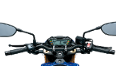 | 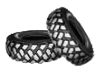 |  |
|:---:|:---:|:---:|:---:|  

Drive faster, jump higher, have more control, and get less damage from jumping too high.

## [Basic Fishing](Manux_BasicFishing)  
| 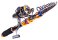 | 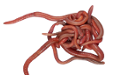 |  | 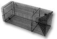 | 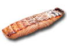 |  | 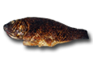 |  |  |
|:---:|:---:|:---:|:---:|:---:|:---:|:---:|:---:|:---:|

## [New Food Recipes](Manux_FoodRecipes)  
|  |  |  | 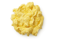 |  |  |  |  |  |
|:---:|:---:|:---:|:---:|:---:|:---:|:---:|:---:|:---:|  

More variety of meals, and more meals that can fill you up.

## [Hydroponic Farming Device](Manux_HydroponicFarm)      
A less annoying and less repetitive way of growing plants.

## [Healing Pod](Manux_HealingPod)    
When powered, heals everything and retores health quickly.

## [Miner Robot](Manux_MinerRobot)  [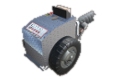](Manux_MinerRobot)  
Have Miner Robots mine ressources for you while you spend time on other things.

## [Perpetual Motion Generator](Manux_PerpetualMotionGenerator)  [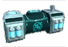](Manux_PerpetualMotionGenerator)  [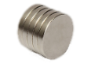](Manux_PerpetualMotionGenerator)  
Rare and expensive, but extremely powerful generator.

## [Magical Power Melee Weapons](Manux_MeleeWeapons)  
| 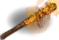 | 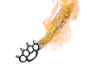 | 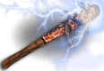 | 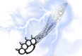 |
|:---:|:---:|:---:|:---:| 

## [New Ranged Weapons](Manux_RangedWeapons)  
| 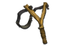 | 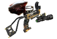 | 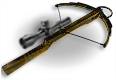 | 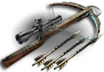 |  |  |
|:---:|:---:|:---:|:---:|:---:|:---:|
| 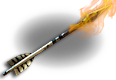 | 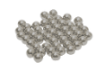 | 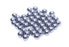 | 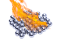 | 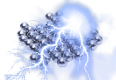 | 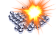 |  

Silenced guns, iron bows and crossbows, scoped crossbows, crossbow repeaters, and slingshots that provide an early game ranged weapon where the ammo is very cheap (repeater slingshot and scoped versions also availlable). 

## [New Traps](Manux_Traps)  
|  |  | 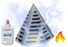 | 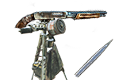 | 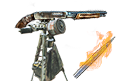 |
|:---:|:---:|:---:|:---:|:---:|  

New upgrades for the Steel Log Spikes, and Dart Auto-Turret and Flaming Dart Auto-Turret.

## [Versatile Mining Tools](Manux_MiningTools)  
| 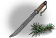 | 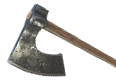 | 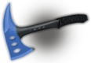 |
|:---:|:---:|:---:|
| Weed Cleaver | Quick Axe | Diamond Axe |  

## [Merchant Workstations](Manux_MerchantWorkstations)  
|  |  | 
|:---:|:---:|
| Virtual Trader | Quest Board |  

Like having a Trader at home!

## [Working Ovens and Sinks](Manux_WorkingOvenAndSink)  
|  |  | 
|:---:|:---:|
| Working Ovens | Working Sinks |  

Get free clean water from Working Sinks and craft food without fuel in Working Ovens.

## And a lot of other cool stuff
- [Steel Armors and Helmets with a light](Manux_ArmorsAndClothing)
- [Bigger Backpack / MiniBike storage, etc...](Manux_BiggerBackPackMiniBikeContainersCraftingSlots)
- [Craft Non-Craftable Items](Manux_CraftNonCraftableItems)
- [Give Back Empty Jars](Manux_GiveBackEmptyJars)
- [Increased Items StackNumber](Manux_IncreasedItemsStackNumber)
- [Simple UI HUD](Manux_SimpleUI_HUD)
- [Admin/Creative Tools](Manux_AdminTools)

